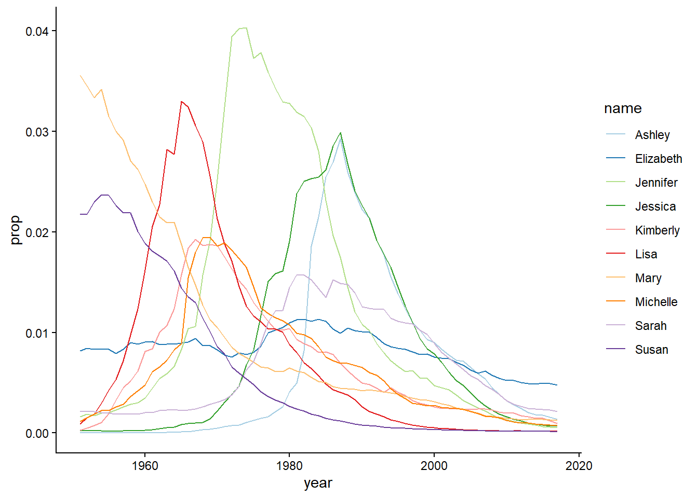
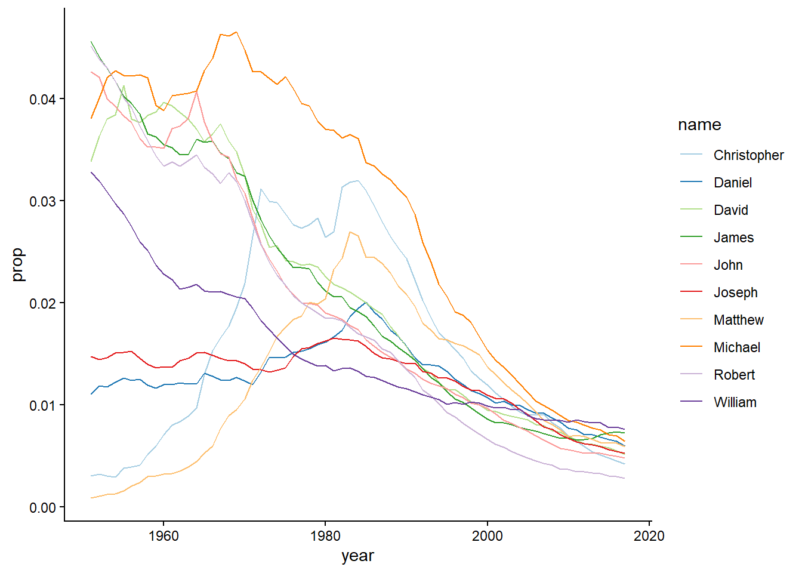

Load packages


::: {.cell}

```{.r .cell-code}
library(babynames)
library(knitr)
library(dplyr)
library(ggplot2)
library(tidyr)
library(pheatmap)
```
:::


Display first 10 lines of babynames table


::: {.cell}

```{.r .cell-code}
head(babynames) |> kable()
```

::: {.cell-output-display}


| year|sex |name      |    n|      prop|
|----:|:---|:---------|----:|---------:|
| 1880|F   |Mary      | 7065| 0.0723836|
| 1880|F   |Anna      | 2604| 0.0266790|
| 1880|F   |Emma      | 2003| 0.0205215|
| 1880|F   |Elizabeth | 1939| 0.0198658|
| 1880|F   |Minnie    | 1746| 0.0178884|
| 1880|F   |Margaret  | 1578| 0.0161672|


:::
:::


::: {.cell}

```{.r .cell-code  code-fold="true"}
get_most_frequent <- function(babynames, select_sex, from = 1950) { most_freq <- babynames |> filter(sex == select_sex, year > from) |> group_by(name) |> summarise(average = mean(prop)) |> arrange(desc(average))

return(list( babynames = babynames, most_frequent = most_freq, sex = select_sex, from = from)) }

plot_top <- function(x, top = 10) { topx <- x$most_frequent$name[1:top]

p <- x$babynames |>
  filter(name %in% topx, sex == x$sex, year > x$from) |> ggplot(aes(x = year, y = prop, color = name)) + geom_line() + scale_color_brewer(palette = "Paired") + theme_classic()

return(p) }
```
:::


Figure top 10 Girls names


::: {.cell}

```{.r .cell-code}
get_most_frequent(babynames, select_sex = "F") |>
  plot_top()
```

::: {.cell-output-display}
{#fig-line-girls width=672}
:::
:::


In @fig-line-girls you can see that there has been a peak in popularity for 'Lisa', 'Jennifer' and 'Jessica'. Interesting! Let's have a look at the boys names:

Figure top 10 Boys names


::: {.cell}

```{.r .cell-code}
get_most_frequent(babynames, select_sex = "M") |>
  plot_top()
```

::: {.cell-output-display}
{#fig-line-boys width=672}
:::
:::


@fig-line-boys shows that names that were popular before 1990 are relatively infrequent after 2000.

